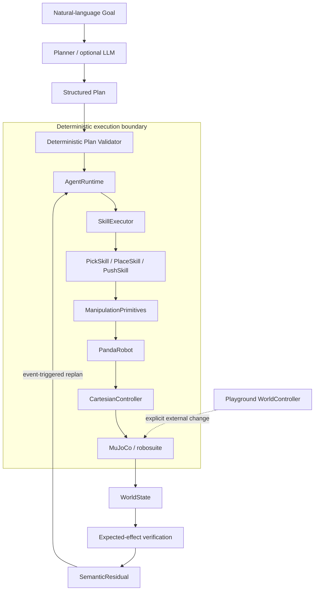

# Semantic Manipulation Stack

A modular manipulation playground for exploring how language-model agents,
semantic skills, classical controllers, learned policies, and world-state
feedback can work together in robotics.

The current implementation runs a Franka Panda in a dynamic MuJoCo / robosuite
tabletop world, executes validated Pick, Place, and classical Push plans,
verifies their semantic effects against simulator ground truth, and replans
only when a meaningful execution event invalidates the current plan.

## What this is

This repository is a small, readable robotics research and engineering
playground. It focuses on the boundary between high-level semantic reasoning
and deterministic robot execution:

- planners produce structured plans from goals and semantic world state;
- a deterministic validator restricts plans to registered skills;
- skills own semantic actions and bounded local recovery;
- reusable Cartesian primitives call a simulator-independent Panda interface;
- only the lowest controller layer constructs robosuite actions.

It is not a general-purpose robot autonomy framework or a production safety
system.

## Architecture



`AgentRuntime` never sends joint commands or simulator actions. See
[docs/architecture.md](docs/architecture.md) for the layer contracts and result
hierarchy and [docs/push_skill.md](docs/push_skill.md) for the classical Push
geometry, FSM, evaluation protocol, and limits.

## Current capabilities

- MuJoCo 3.3.x and robosuite 1.5.2 tabletop simulation
- Franka Panda with Cartesian OSC pose control
- explicit Cartesian workspace bounds
- interpolated `move_to_pose` and straight-line `move_linear` primitives
- gripper open, close, and bounded wait primitives
- simulator-ground-truth `WorldModel` and serializable `WorldState`
- explicit Pick, Place, and classical Cartesian Push finite-state machines
  with bounded local recovery
- machine-readable `SkillRegistry` with preconditions and expected effects
- strict structured-plan parsing and deterministic validation
- semantic effect verification through `SemanticResidual`
- event-triggered replanning with a bounded replan budget
- deterministic offline planner for tests and evaluation
- optional, isolated OpenAI-compatible LLM planner adapter
- three movable cubes, two target trays, and a temporary placement area
- geometric `inside`, `occupied`, `occupied_by`, `left_of`, `right_of`, and
  `near` relations
- bounded symbolic composition of registered Pick, Place, and Push effects
- a dedicated `right_side` semantic push region, separate from Place targets
- explicit capability-gap plans for valid but unsupported goals
- an interactive semantic-step playground with observable world changes

The validated nominal baselines are 20/20 randomized Pick-to-Place tasks and
20/20 randomized classical Push tasks for the supported `right_side` region.

## Example: closed-loop recovery

```text
Goal:
Put the red cube inside the blue target.

Plan v1:
1. Pick(red_cube)
2. Place(red_cube, blue_target)

Pick succeeds.

External disturbance:
the cube is no longer held and is reachable on the table.

Expected:
holding = red_cube

Observed:
holding = none

SemanticResidual:
OBJECT_LOST

Replan:

Plan v2:
1. Pick(red_cube)
2. Place(red_cube, blue_target)

Goal succeeds.
```

The recovery plan comes through the planner interface. `AgentRuntime` does not
contain an `if object_lost: pick_again` rule, and ordinary grasp or release
retries remain local to their skills.

## Quick start

Python 3.11 is recommended on macOS. The project supports Python
`>=3.10,<3.13`.

```bash
git clone https://github.com/Block-O2/semantic-manipulation-stack.git
cd semantic-manipulation-stack
python3.11 -m venv .venv
source .venv/bin/activate
python -m pip install --upgrade pip
python -m pip install -e '.[dev]'
pytest -q
```

The dependency constraints intentionally preserve the validated combination:

```text
robosuite == 1.5.2
mujoco >= 3.3, < 3.4
numpy >= 1.24, < 2
```

MuJoCo's interactive macOS viewer must run through `mjpython`. Headless commands
use the regular virtual-environment Python interpreter.

## Running demos

Headless closed-loop agent:

```bash
python -m demos.semantic_agent --no-render --inspect-seconds 0
```

Interactive macOS viewer:

```bash
mjpython -m demos.semantic_agent
```

Dynamic-world playground (pauses before every semantic step):

```bash
python -m demos.dynamic_playground --no-render --inspect-seconds 0
mjpython -m demos.dynamic_playground
```

At a pause, commands such as `move object red_cube -0.05 -0.10`,
`move target blue_target 0.20 0.10`, `drop`, `occupy blue_target green_cube`,
`remove red_cube`, and `restore red_cube` make explicit world changes. Run
`help` in the demo for the complete command list.

Run all deterministic dynamic scenarios with:

```bash
python -m demos.dynamic_scenarios --scenario all
```

Controlled object-loss recovery:

```bash
python -m demos.semantic_agent \
  --no-render \
  --disturbance object-lost \
  --inspect-seconds 0
```

Other useful entry points:

```bash
python -m demos.robot_motion --no-render --inspect-seconds 0
python -m demos.grasp_test --no-render --inspect-seconds 0
python -m demos.pick_test --no-render --inspect-seconds 0
python -m demos.pick_place_task --no-render --inspect-seconds 0
python -m demos.push_test --no-render --inspect-seconds 0

python -m evaluation.agent_trials --trials 20 --seed 59
python -m evaluation.agent_disturbances
python -m evaluation.push_trials --trials 20 --seed 127
```

To use the optional LLM planner, configure an OpenAI-compatible endpoint. These
values are read only from the environment and are never stored in source code:

```bash
export SEMANTIC_AGENT_MODEL='your-model'
export SEMANTIC_AGENT_API_KEY='your-key'
export SEMANTIC_AGENT_BASE_URL='https://your-provider.example/v1'  # optional
mjpython -m demos.semantic_agent --planner llm
```

All LLM output still passes through the deterministic plan validator.

## Project structure

```text
sim/          MuJoCo / robosuite environment and tabletop scene
robot/        Panda abstraction and the only robosuite action-vector controller
world/        Ground-truth WorldModel and serializable semantic WorldState
primitives/   Safe Cartesian and gripper manipulation primitives
skills/       Pick, Place, and classical Push FSMs with local recovery
planner/      Goal/Plan schemas, SkillRegistry, effects, validation, backends
runtime/      SkillExecutor, AgentRuntime, result hierarchy, skill factory
evaluation/   Nominal trials and evaluation-only controlled disturbances
demos/        Runnable headless and interactive examples
playground/   Explicit external world-state modification tools
tests/        Offline deterministic and headless simulation tests
docs/         Architecture and milestone notes
```

## Design principles

- Goals and plans are different: the original goal survives replanning.
- Plan completion is not goal completion; fresh world state decides success.
- Planner output is data, never executable Python.
- Only registered semantic skills can appear in a validated plan.
- Agents handle semantic deviations; skills handle bounded local recovery.
- Task reasoning never commands joints, primitives, or simulator actions.
- Simulator-specific control vectors exist only in `CartesianController`.
- Core tests remain deterministic, offline, CPU-only, and camera-free.

## Milestones

Milestones M0 through M6 are implemented and validated. Later milestones are
exploratory directions rather than commitments. See
[docs/milestones.md](docs/milestones.md).

## Limitations

The repository does **not** yet provide:

- camera perception or visual scene understanding;
- VLA models, ACT, reinforcement learning, or imitation learning;
- ROS integration;
- obstacle-aware or general-purpose motion planning;
- execution of relation goals such as `left_of` or `near`;
- push destinations other than the explicit `right_side` v1 region;
- obstacle-aware, curved, force-controlled, or multi-object push planning;
- general-purpose manipulation beyond the known cube and target scene;
- production safety, real-robot validation, or formal safety guarantees.

Reachability and semantic relations are deliberately simple, simulator-backed
approximations for the current tabletop scenario.

## Roadmap

Near-term exploration may broaden deterministic push directions and disturbance
benchmarks. A later experiment could place a learned implementation behind the
same trusted semantic `Push(object, target)` interface. No ACT, VLA, or learned
push backend is implemented today.
