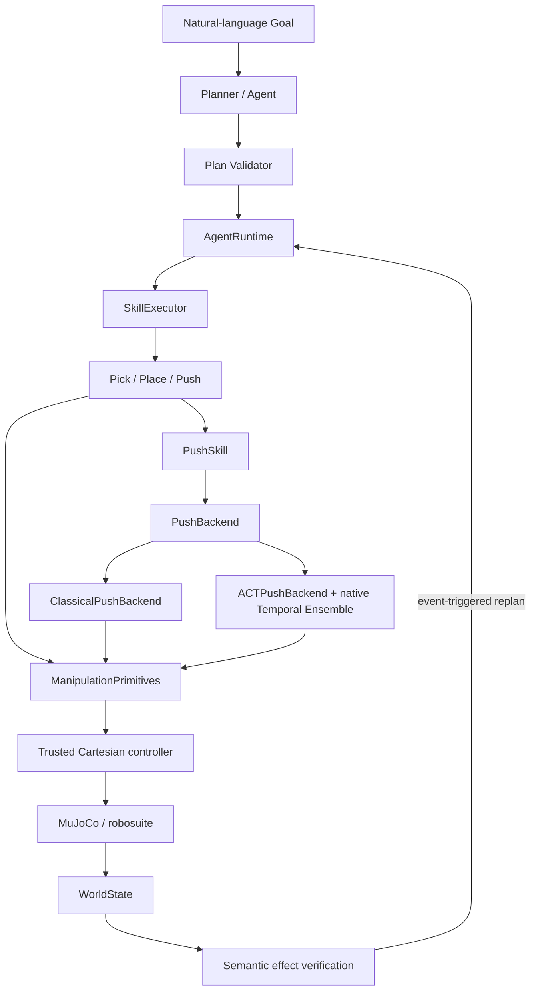

# Semantic Manipulation Stack

A modular MuJoCo manipulation playground for exploring how semantic agents,
trusted skills, classical controllers, learned policies, and world-state
feedback can work together.

The repository connects validated task-level plans to Pick, Place, and Push
execution on a Franka Panda, then checks physical outcomes against fresh
simulator state. It is an engineering and research playground—not a
general-purpose robot framework or a claim of general manipulation
intelligence.

## Why this project exists

The central question is how to connect high-level semantic reasoning, robot
skills, learned motor policies, classical control, and execution feedback
without allowing one layer to silently take over another layer's job.

Goals become structured plans; plans are validated against registered skills;
skills own bounded local recovery; physical backends execute behind a trusted
Cartesian safety boundary; and the Agent replans only when fresh world state
shows a meaningful semantic deviation.

## Architecture



Semantic layers never construct raw simulator actions. Learned targets pass
through the same finite, workspace, step-limit, primitive, and Cartesian
controller path as classical execution. The detailed contracts and result
hierarchy are in [docs/architecture.md](docs/architecture.md).

## What currently works

- validated Pick and Place skills with bounded local recovery;
- structured planning, deterministic validation, and semantic effect checks;
- event-triggered replanning after explicit dynamic-world disturbances;
- bounded composition of registered skills for occupied destinations;
- classical Cartesian Push to the `right_side` semantic region;
- a pluggable `PushBackend` boundary shared by classical and learned execution;
- LeRobot 0.4.4 ACT Push with native Temporal Ensemble;
- a 20 Hz state/action demonstration pipeline and frozen diagnostic baselines.

The meaningful runtime Push paths are `ClassicalPushBackend` and
`ACTPushBackend` with native Temporal Ensemble. One-step BC,
progress-conditioned BC, simple Chunk BC, and ACT queue execution remain in the
repository as experimental baselines for understanding temporal aliasing,
execution horizon, and temporal ensembling—not as recommended robot runtimes.

## Key validated results

Deterministic nominal checks reached 20/20 for Pick→Place, classical Push, and
the full nominal Agent path. On the same 20 replay-stable Push states:

| Physical Push implementation | Matched success |
|---|---:|
| Classical FSM | 20/20 |
| One-step BC | 0/20 |
| Simple Chunk BC K=20/H=20 | 2/20 |
| ACT queue K=32/H=8 | 0/20 |
| ACT + native Temporal Ensemble K=32/H=1 | **20/20** |

The ACT queue and Temporal Ensemble evaluations reuse the same trained neural
weights; only inference changed. This is a fixed-workspace diagnostic result,
not evidence of open-scene or general-purpose manipulation.

The classical expert contains hidden execution intent in its finite-state
sequence, while the state-only imitation dataset presents near-identical
observations with different desired actions. Naive one-step and queued sequence
execution failed on the frozen states. Native ACT Temporal Ensemble lets
overlapping action predictions made from past observations contribute to the
current action, restoring successful Push behavior in this specific setting.
See [docs/experiments.md](docs/experiments.md),
[docs/chunk_bc_experiment.md](docs/chunk_bc_experiment.md), and
[docs/act_push_backend.md](docs/act_push_backend.md) for evidence and limits.

## Quick start

Python 3.11 is recommended on macOS; supported versions are `>=3.10,<3.13`.

```bash
git clone https://github.com/Block-O2/semantic-manipulation-stack.git
cd semantic-manipulation-stack
python3.11 -m venv .venv
source .venv/bin/activate
python -m pip install -e '.[dev]'
pytest -q
```

Validated core dependency constraints are `robosuite==1.5.2`,
`mujoco>=3.3,<3.4`, and `numpy>=1.24,<2`. Interactive macOS viewers must run
through `mjpython`; headless commands use the virtual-environment Python.

## Running the main demos

```bash
# Closed-loop semantic Agent
python -m demos.semantic_agent --no-render --inspect-seconds 0

# Inspectable dynamic-world playground
python -m demos.dynamic_playground --no-render --inspect-seconds 0

# Classical Push through the complete Agent path
python -m demos.push_test --no-render --inspect-seconds 0
```

Rendered macOS runs use `mjpython` and omit `--no-render`. ACT additionally
requires the optional dependencies and a locally available, Git-ignored
checkpoint:

```bash
python -m pip install -e '.[dev,act]'
python -m demos.push_test --no-render --inspect-seconds 0 \
  --push-backend act \
  --act-execution-mode temporal_ensemble \
  --checkpoint checkpoints/push_act_seed17.pt
```

Checkpoint training and frozen evaluation commands live in the experiment
docs; the repository commits compact result records, not datasets or model
weights.

## Project map

```text
sim/           MuJoCo / robosuite environment and tabletop scene
robot/         Panda abstraction and the sole raw simulator-action controller
world/         Ground-truth WorldModel and serializable semantic WorldState
primitives/    Workspace-bounded Cartesian and gripper execution
skills/        Semantic skills plus classical and learned Push backends
planner/       Goal/Plan schemas, registry, effects, validation, and planners
runtime/       AgentRuntime, SkillExecutor, results, and backend wiring
datasets/      Imitation-data schema, recording, NPZ I/O, and action windows
learning/      Learned-policy implementations and training support
evaluation/    Frozen comparisons, diagnostics, and nominal trials
artifacts/     Lightweight committed metrics and representative traces
demos/         Headless and interactive entry points
playground/    Explicit external world-change tools
tests/         Deterministic unit and headless simulation tests
docs/          Architecture, milestones, and experiment reports
side_projects/ Separate non-mainline reproductions
```

`side_projects/agent_act_reproduction/` is a separate three-demo ACT
reproduction project maintained outside the main semantic-manipulation
architecture. Its code and checkpoints are not imported by the main runtime.

## Design principles

- A Goal is not a Plan; the original Goal survives replanning.
- Plan completion is not goal completion; fresh world state decides success.
- Planner output is structured data and must pass deterministic validation.
- Semantic layers never command joints, primitives, or raw simulator actions.
- Skills own bounded local recovery; the Agent owns semantic deviations.
- Physical Push execution is interchangeable behind `PushBackend`.
- Learned policies remain behind the same trusted safety/controller boundary.
- Results stay layered so failures remain attributable and auditable.

## Limitations

- observations are state-only and derived from MuJoCo ground truth;
- the world is a fixed tabletop scene with no real perception or real robot;
- public Push supports only the explicit `right_side` region;
- there is no open-world task learning or general manipulation policy;
- ACT Temporal Ensemble's 20/20 result covers only the frozen matched
  distribution and does not establish task or scene generalization;
- motion planning is not obstacle-aware or force-controlled;
- the system has no production or formally verified safety guarantee.

## Roadmap

The stable checkpoint is the semantic Agent with trusted classical skills and
classical/ACT Push implementations. Possible next explorations include
execution monitoring with event-triggered intervention, learned-policy safety
filtering, or another mature motor-policy baseline such as Diffusion Policy.
These are exploratory directions, not commitments; M8 has not been started.

See [docs/milestones.md](docs/milestones.md) for the completed M0–M7 sequence.
