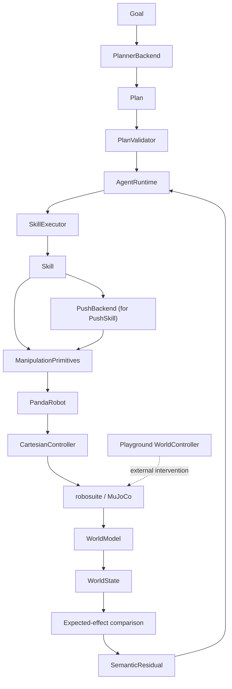

# Architecture

Semantic Manipulation Stack separates semantic reasoning from deterministic
robot execution. Each layer has one narrow responsibility and communicates
through structured data or explicit result types.

## Data and control flow



## Abstraction boundaries

### AgentRuntime

`AgentRuntime` owns task-level closed-loop orchestration:

- preserve the original Goal;
- request a Plan from `PlannerBackend`;
- require deterministic validation before execution;
- execute one semantic step through `SkillExecutor`;
- observe a fresh `WorldState`;
- compare expected and observed semantic effects;
- replan only after a meaningful invalidation event;
- stop when the physical Goal is satisfied or the replan budget is exhausted.

`AgentRuntime` must never control joints, call manipulation primitives, or
construct simulator actions directly.

Before every semantic step, the runtime emits an `AgentBoundaryEvent`, invokes
an optional inspection hook, and observes the world again. The hook may pause a
demo or apply an explicit test disturbance, but the runtime never receives a
simulator handle. If the refreshed state still satisfies the next step's
preconditions, execution continues without replanning; otherwise the semantic
change is recorded and routed back through the planner.

### SkillExecutor

`SkillExecutor` performs deterministic sequencing. It runs caller-supplied
skills in order and stops at the first failed `SkillResult`. It does not plan,
replan, inspect primitive internals, or implement recovery policy.

The Agent uses one-step executor calls so it can observe and verify semantic
effects between steps without bypassing this boundary.

### Skill

A Skill represents a semantic action such as Pick, Place, or Push. Skills own:

- task-level preconditions;
- an explicit finite-state execution sequence;
- translation of primitive failures into semantic failure reasons;
- bounded, action-specific local recovery.

Ordinary grasp retries and release retries remain inside their corresponding
skills. They are not promoted into Agent-level replanning events unless the
Skill ultimately fails or its expected semantic effect is absent.

`PushSkill` is the first nonprehensile capability. The planner sees only
`Push(object, target)`. A dedicated geometry generator converts the observed
object pose and named push-region bounds into pre-push, contact, end, and
retreat poses. The Skill then uses the same generic Cartesian primitives as
Pick and Place. It does not inspect robosuite actions or MuJoCo state.

Push contact is currently a documented geometric proxy: after approaching the
contact pose, the Skill checks end-effector-to-object proximity through the
read-only `WorldModel`. Physical success is stricter than robot trajectory
completion: the cube must move by the minimum displacement, finish inside the
requested semantic region, and remain on the table. One local retry may
retreat, refresh the object pose, recompute geometry, and try again.

### Manipulation primitive

Primitives provide reusable robot behaviors such as interpolated Cartesian
motion, straight-line motion, gripper commands, and bounded waits. They enforce
workspace bounds, tolerances, step limits, and structured failure results.

Primitives call `PandaRobot`; they do not know the robosuite action-vector
layout.

### PandaRobot

`PandaRobot` is the simulator-independent robot abstraction exposed to the
primitive layer. It accepts absolute Cartesian poses and gripper operations.

### CartesianController

`CartesianController` translates absolute end-effector targets into robosuite
OSC pose deltas and gripper commands.

It is the only production layer allowed to construct or submit the robosuite
control action vector. Higher layers must never infer action indices, command
joints, or call `env.step()` directly.

## Semantic state and effects

`WorldModel` converts simulator ground truth into a serializable `WorldState`
containing only task-relevant facts:

- which object, if any, the robot holds;
- known object and target poses;
- existence and simple reachability;
- grasp and target occupancy state;
- named relations such as `red_cube_inside_blue_target`;
- dedicated semantic push regions and relations such as
  `red_cube_inside_right_side`.

The dynamic playground additionally derives `left_of`, `right_of`, and `near`
from object geometry using configurable `SemanticThresholds`. These relations
are observations, not promises that a corresponding execution Skill exists.

Each `SkillSpec` contains symbolic expected effects. For example, Pick expects
the robot to hold the requested object and the object to be grasped. After the
Skill returns, these effects are compared with a fresh state. Any mismatch is a
structured `SemanticResidual` and can trigger replanning.

This is a symbolic task-level transition model, not a learned or geometric
physics predictor.

## Planner safety boundary

Planner output is parsed as strict `Plan` data and validated against the
machine-readable `SkillRegistry`. Validation rejects:

- unknown skills;
- missing or extra arguments;
- unknown objects or targets;
- arbitrary fields;
- controller or primitive commands;
- unsatisfied preconditions, including projected preconditions across steps.

The optional LLM adapter cannot execute code. Its output is treated exactly like
any other untrusted planner response.

A planner may return a structured `CANNOT` plan with `missing_capabilities` for
a well-formed goal that the registry cannot execute. Supported push goals now
produce a validated `Push` step; a genuinely unsupported action such as
`open_drawer` still reports an explicit capability gap. An occupied target is
not automatically a capability gap: when `occupied_by` identifies a movable
object and a free alternate target exists, the deterministic planner searches a
small symbolic state space and composes a rearrangement plan. Capability gaps
are explicit outcomes and are never converted into hidden simulator edits.

The same symbolic transition model is used by bounded planning and by
`PlanValidator`'s projected precondition checking. Picking an object removes it
from prior occupancy, placing adds it to a Place target, and pushing moves it
into the requested push region. This allows multi-step plans to remain strictly
validated without embedding rearrangement or push policy in `AgentRuntime`.

The classical implementation is the reliable backend for the semantic Push
contract. An experimental one-step BC backend demonstrates that a learned
implementation can be selected while retaining the registry, validator, Agent,
result, and controller boundaries. It is a weak baseline, not ACT or a
production-capable learned policy.

Push physical execution is now selected behind a narrow `PushBackend`
protocol. `PushSkill` owns semantic verification and retry policy;
`ClassicalPushBackend` owns scripted geometry and motion, while the experimental
`BCPushBackend` predicts one absolute EE xyz at a time. Backend injection occurs
in `SemanticSkillFactory`, so AgentRuntime, SkillExecutor, planner, and registry
remain backend-independent.

For imitation data, `CartesianController` publishes a read-only command event
immediately before each simulator control step. A recorder combines that event
with read-only `WorldModel` state. The observer cannot submit actions and does
not expose raw MuJoCo state. Learned predictions return through a bounded
primitive and the normal Panda/controller path; policy code never calls
`env.step()` or constructs robosuite vectors.

## Result hierarchy

Results remain layered rather than collapsed:

```text
PrimitiveResult
    outcome of one bounded manipulation primitive
        ↓
SkillResult
    semantic Skill outcome, phase, attempts, and local failure reason
        ↓
TaskResult
    deterministic SkillExecutor outcome and completed/failed step
        ↓
AgentResult
    Goal outcome, planner calls, replans, plan history, residuals,
    executed TaskResults, and final WorldState
```

This hierarchy makes failures attributable to the layer that owns them while
preserving lower-level evidence for evaluation and debugging.

## Explicit world changes

`playground.WorldController` is the dedicated boundary for moving, dropping,
removing, or restoring scene entities outside normal robot execution. It is
used by interactive demos and controlled evaluations. It is not available to
planner output and is never used as hidden recovery by Agent, Skill, Primitive,
or Robot layers.

Only `CartesianController` constructs robosuite robot action vectors. Direct
MuJoCo state editing in `WorldController` represents an external world event,
not a robot command, and is intentionally isolated from the production control
chain.
