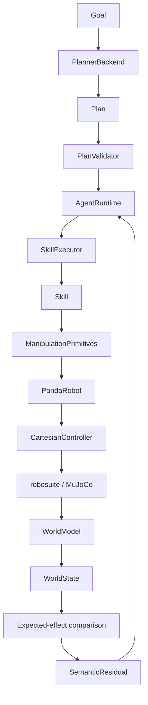

# Architecture

Semantic Manipulation Stack separates semantic reasoning from deterministic
robot execution. Each layer has one narrow responsibility and communicates
through structured data or explicit result types.

## Data and control flow



## Abstraction boundaries

### AgentRuntime

`AgentRuntime` owns task-level closed-loop orchestration:

- preserve the original Goal;
- request a Plan from `PlannerBackend`;
- require deterministic validation before execution;
- execute one semantic step through `SkillExecutor`;
- observe a fresh `WorldState`;
- compare expected and observed semantic effects;
- replan only after a meaningful invalidation event;
- stop when the physical Goal is satisfied or the replan budget is exhausted.

`AgentRuntime` must never control joints, call manipulation primitives, or
construct simulator actions directly.

### SkillExecutor

`SkillExecutor` performs deterministic sequencing. It runs caller-supplied
skills in order and stops at the first failed `SkillResult`. It does not plan,
replan, inspect primitive internals, or implement recovery policy.

The Agent uses one-step executor calls so it can observe and verify semantic
effects between steps without bypassing this boundary.

### Skill

A Skill represents a semantic action such as Pick or Place. Skills own:

- task-level preconditions;
- an explicit finite-state execution sequence;
- translation of primitive failures into semantic failure reasons;
- bounded, action-specific local recovery.

Ordinary grasp retries and release retries remain inside their corresponding
skills. They are not promoted into Agent-level replanning events unless the
Skill ultimately fails or its expected semantic effect is absent.

### Manipulation primitive

Primitives provide reusable robot behaviors such as interpolated Cartesian
motion, straight-line motion, gripper commands, and bounded waits. They enforce
workspace bounds, tolerances, step limits, and structured failure results.

Primitives call `PandaRobot`; they do not know the robosuite action-vector
layout.

### PandaRobot

`PandaRobot` is the simulator-independent robot abstraction exposed to the
primitive layer. It accepts absolute Cartesian poses and gripper operations.

### CartesianController

`CartesianController` translates absolute end-effector targets into robosuite
OSC pose deltas and gripper commands.

It is the only production layer allowed to construct or submit the robosuite
control action vector. Higher layers must never infer action indices, command
joints, or call `env.step()` directly.

## Semantic state and effects

`WorldModel` converts simulator ground truth into a serializable `WorldState`
containing only task-relevant facts:

- which object, if any, the robot holds;
- known object and target poses;
- existence and simple reachability;
- grasp and target occupancy state;
- named relations such as `red_cube_inside_blue_target`.

Each `SkillSpec` contains symbolic expected effects. For example, Pick expects
the robot to hold the requested object and the object to be grasped. After the
Skill returns, these effects are compared with a fresh state. Any mismatch is a
structured `SemanticResidual` and can trigger replanning.

This is a symbolic task-level transition model, not a learned or geometric
physics predictor.

## Planner safety boundary

Planner output is parsed as strict `Plan` data and validated against the
machine-readable `SkillRegistry`. Validation rejects:

- unknown skills;
- missing or extra arguments;
- unknown objects or targets;
- arbitrary fields;
- controller or primitive commands;
- unsatisfied preconditions, including projected preconditions across steps.

The optional LLM adapter cannot execute code. Its output is treated exactly like
any other untrusted planner response.

## Result hierarchy

Results remain layered rather than collapsed:

```text
PrimitiveResult
    outcome of one bounded manipulation primitive
        ↓
SkillResult
    semantic Skill outcome, phase, attempts, and local failure reason
        ↓
TaskResult
    deterministic SkillExecutor outcome and completed/failed step
        ↓
AgentResult
    Goal outcome, planner calls, replans, plan history, residuals,
    executed TaskResults, and final WorldState
```

This hierarchy makes failures attributable to the layer that owns them while
preserving lower-level evidence for evaluation and debugging.

## Evaluation-only disturbances

Controlled disturbances live under `evaluation/` and may alter MuJoCo state to
create reproducible experiments. They are not production behaviors, are not
available to planner output, and do not add simulator hacks to Pick or Place.
